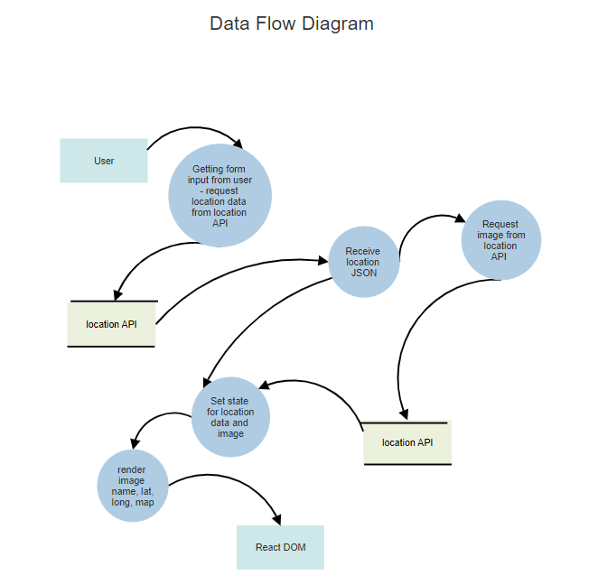
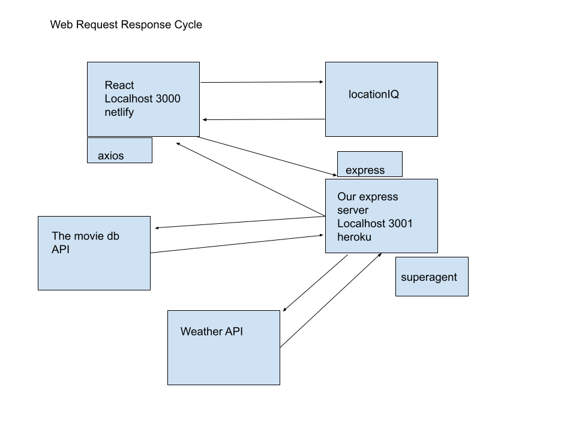

# city-explorer-backend

**Author**: Peter Staker
**Version**: 1.0.4

## Overview

This is the API for my city-explorer web app.

## Getting Started

1. Clone or fork repo

1. npm install dependences, express, cors, dotenv

1. run application in the terminal - npm start, node index, nodemon

## Architecture

Built using Node, Express, cors, dotenv.

This application receives request from the city explorer frontend and returns data.

Web Request Response Cycle

Web Request Response Cycle

## Change Log

03-23-2021 3:20pm - Application now has a fully-functional express server, with a GET route for the location resource.
03-24-2021 7:49pm - Application makes API calls to movie and weather APIs, then sends data to frontend
03-25-2021 7:33pm - Requests movie and weather data from API and sends results to frontend.
03-26-2021 2:23pm - Refactoring and modulization.
03-27-2021 4:02pm - Added local memory db - cache.
