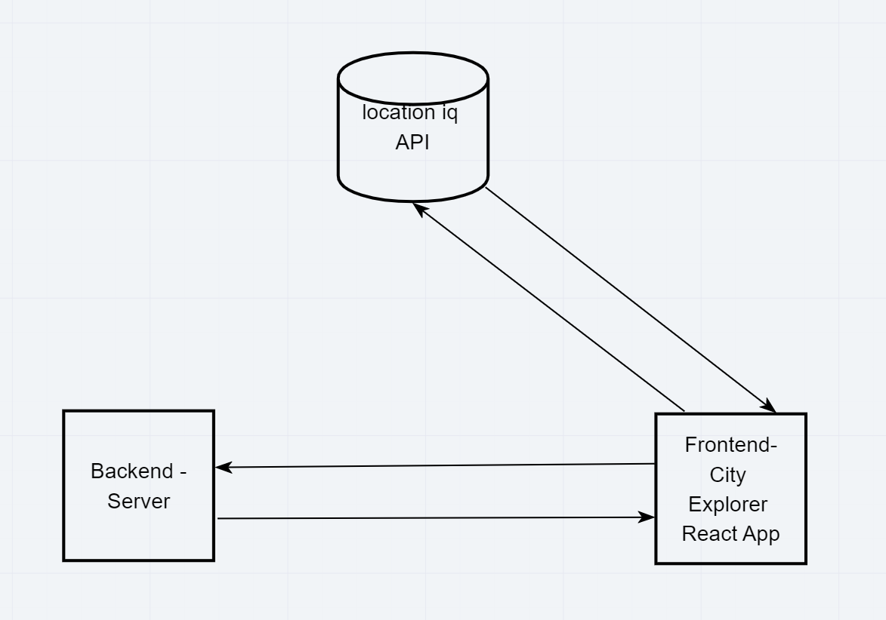

# city-explorer-backend

**Author**: Peter Staker
**Version**: 1.1.0

## Overview

This is the API for my city-explorer web app.

## Getting Started

1. Clone or fork repo

1. npm install dependences, express, cors, dotenv

1. run application in the terminal - npm start, node index, nodemon

## Architecture

Built using Node, Express, cors, dotenv.

This application receives request from the city explorer frontend and returns data.

Web Request Response Cycle:

## Change Log

03-23-2021 3:20pm - Application now has a fully-functional express server, with a GET route for the location resource.
03-24-2021 7:49pm - Application makes API calls to movie and weather APIs, then sends data to frontend

## Credit and Collaborations

Web Request Response Cycle Diagram made with [Jacob Holmer](https://github.com/Pratibhaprogrammer)

Time Estimates

***
Name of feature: Set up server repository

Estimate of time needed to complete: 1 hour

Start time: 1pm

Finish time: 1:30pm

Actual time needed to complete: 30minutes

***
Name of feature: Weather Placeholder - send weather data

Estimate of time needed to complete: 2 hour

Start time: 1:30pm

Finish time: 2:30pm

Actual time needed to complete: 1 hour

***

Name of feature:  Errors - send error response

Estimate of time needed to complete: 2 hour

Start time: 2:30pm

Finish time: 3:30pm

Actual time needed to complete: 1 hour

***

Name of feature: Weather API

Estimate of time needed to complete: 1 hour

Start time: 1pm

Finish time: 1:30pm

Actual time needed to complete: .5 hours

***

Name of feature: Movie API

Estimate of time needed to complete: 2 hour

Start time: 2pm

Finish time: 3pm

Actual time needed to complete: 1 hour

***

Name of feature: Deploy

Estimate of time needed to complete: 1 hour

Start time: 3pm

Finish time: 5pm

Actual time needed to complete: 2 hours
